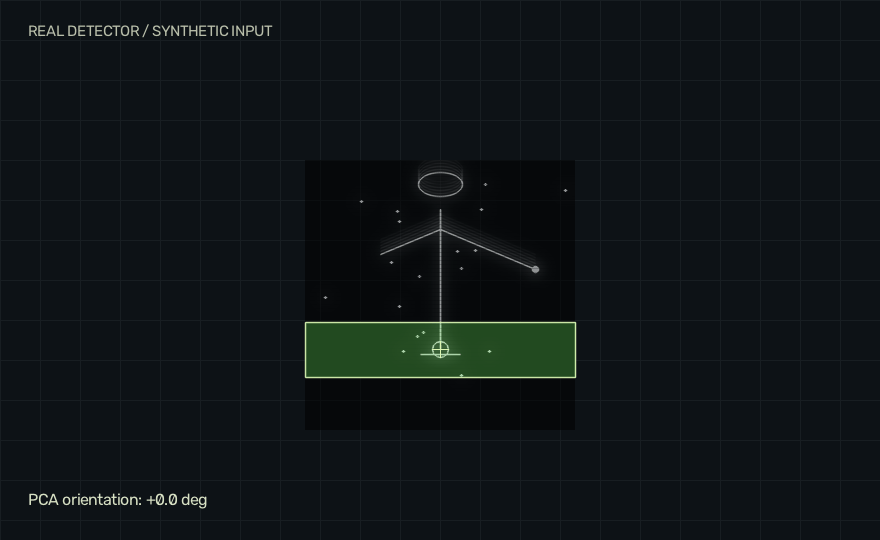
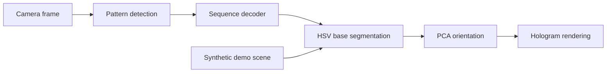

<div align="center">

# Hologram Lab
### Classical computer vision meets augmented reality.

**Co-developed by Liam Esgueva & Sergio Fernández · Comillas ICAI**

[Try locally](#try-the-camera-free-demo) · [How it works](#how-it-works) · [Technical notes](docs/technical-notes.md) · [Original project](https://github.com/SergioFdz05/Hologram_AugmentedReality)

</div>



Detect a geometric pattern sequence, track a green base, and anchor a procedural hologram to its pose. This project combines image processing, finite-state decoding, PCA, and real-time image composition.

## Try the camera-free demo

```bash
git clone https://github.com/liiiaamm/Hologram_AugmentedReality.git
cd Hologram_AugmentedReality
python -m venv .venv
# Activate .venv using the command for your shell.
python -m pip install -r requirements-demo.txt
python demo/server.py
```

Open **http://127.0.0.1:8765**. Rotate the base, toggle the geometry overlay, or play the animation. Stop the server with `Ctrl+C`.

The demo executes the **original `GreenBaseDetector` and `HologramRenderer`** on a synthetic scene. It requires no camera, model weights, account, or API key. It does not exercise camera calibration or shape authentication. Tested with Python 3.12, OpenCV 5.0, NumPy 2.5 and Pillow 12.3.

## How it works



| Component | Engineering idea | Source |
| --- | --- | --- |
| Pattern recognition | Thresholding, morphology and contour geometry | `src/security/pattern_detector.py` |
| Sequence decoding | Stable detections and ordered state transitions | `src/security/decoder.py` |
| Base tracking | HSV segmentation and geometric filtering | `src/tracker/base_detector.py` |
| Orientation | Principal component analysis of the contour | `src/tracker/base_detector.py` |
| Rendering | Rotation, anchoring, glow, scanlines and flicker | `src/hologram/` |

## Webcam application

Use a **separate environment** with `numpy` and `opencv-python` installed; the headless demo package does not provide desktop windows. From the repository root, run `python -m src.main`. The application requests the local webcam and first runs the shape-sequence stage, then the tracker. Calibration utilities live in `src/calibration/`; see the technical notes for their workflow. Hardware behavior depends on your camera and lighting and was not revalidated in this update.

## Authorship & portfolio edition

This is a fork of the jointly developed coursework project, preserving the original history and authorship. Liam's portfolio edition adds the camera-free demo, generated preview, and clearer setup documentation. The preview is actual renderer output on synthetic input, not camera footage.
